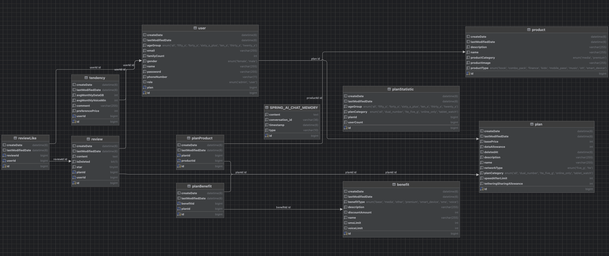

# YoAJung (요금제 아라서 정해드림)

  

---

## 프로젝트 개요

- Spring Boot 기반 요금제 추천 서비스
- LLM을 사용하여 사용자 요구에 따른 맞춤 요금제를 추천

---

## Index

1. [팀원](#팀원)
2. [주요 기능](#주요-기능)
3. [기술 스택](#기술-스택)
4. [ERD](#erd)
5. [시연 화면](#시연-화면)

---

## 팀원

| 이름  | 역할                  | 주요 구현 내용                                  | GitHub                                                                                                                                                         |
|-----|---------------------|-------------------------------------------|----------------------------------------------------------------------------------------------------------------------------------------------------------------|
| 이희용 | AI, 백엔드, 프론트엔드 (팀장) | AI 프롬프트 엔지니어링, AI 챗봇 비지니스 로직              |  |
| 박소연 | AI, 백엔드 (팀원)        | 리뷰 비지니스 로직, 챗봇 키워드 기반 동적 쿼리 조회, 관리자 리뷰 관리 |            |
| 신혜원 | 백엔드, 프론트엔드 (팀원)     | 요금제 비지니스 로직                               |             |
| 이재윤 | AI, 백엔드 (팀원)        | AI 챗봇 비지니스 로직, 관리자 비지니스 로직, 통계            |           |
| 정동현 | 백엔드 (팀원)            | 서비스 인증 / 인가 (OAuth 2.0, SMTP 인증)          |   |
| 홍석준 | 백엔드 (팀원)            | 관리자 인증 / 인가, 요금제 비지니스 로직                  |            |

---

## 주요 기능

### 서비스

* 인증 인가
    * 로그인, 로그아웃, 회원가입

* 요금제
    * 상세, 필터, 정렬, 페이징

* 리뷰
    * CRUD, 좋아요, 평점

* AI
    * 키워드 추출, 멀티턴, 욕설 필터링, 요금제 추천

### 관리자

* 인증 인가
    * 로그인, 로그아웃

* 요금제 관리
    * CRUD

* 리뷰 관리
    * 조회, 삭제

* 통계
    * 일간, 주간, 월간 챗봇(채팅량, 사용자 수) 통계
    * 월간 요금제 선호도 통계

---

## 기술 스택

- Spring Boot
- Spring Web
- Spring Data JPA
- Spring Security
- Spring AI
- OAuth 2.0
- Lombok
- MySQL
- Query DSL
- JUnit5
- Docker
- Redis
- Swagger

---

## ERD

---
